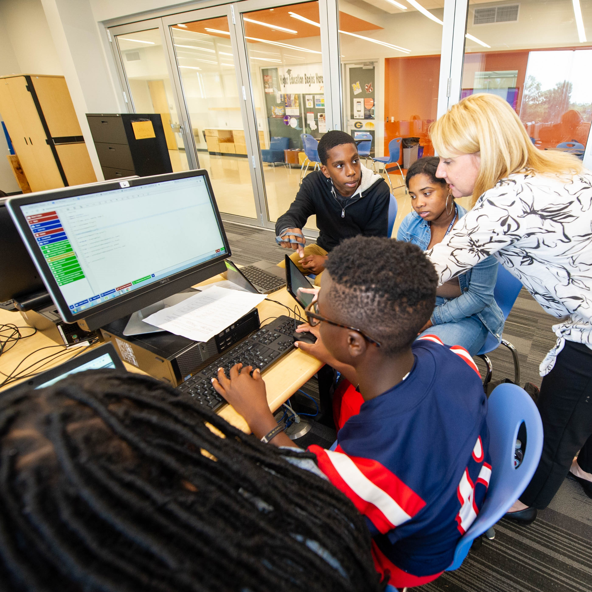

<a href="#" class="w3-text-indigo" onclick="plusDivs(-1)"><strong>&#10094;</strong></a>

<a href="#" class="w3-text-indigo" onclick="plusDivs(+1)"><strong>&#10095;</strong></a>

<a href="#" class="w3-text-indigo" onclick="plusDivs(-1)"><strong>&#10094;</strong></a>

<a href="#" class="w3-text-indigo" onclick="plusDivs(+1)"><strong>&#10095;</strong></a>

<a href="#" class="w3-text-indigo" onclick="plusDivs(-1)"><strong>&#10094;</strong></a>

<a href="#" class="w3-text-indigo" onclick="plusDivs(+1)"><strong>&#10095;</strong></a>

BRBytes was formed through a Research Practitioner Partnership between East Baton Rouge Parish School System (EBRPSS) and Louisiana State University (LSU) to bridge the gap in computer science and computational thinking education in Louisiana. The program does this by developing and implementing several middle and high school courses in EBRPSS and surrounding school districts.

<h3 class="w3-padding"><strong>Progress We Have Made</strong></h3>

- Developed 7 computer science and computational thinking courses for 7-12th grade students
- Implemented BRBytes curriculum in 30 schools across 6 districts in Louisiana
- Trained 41 teachers
- Currently educating 1837 students

 

<h3 class="w3-padding"><strong>Progress We Have Made</strong></h3>

- Developed 7 computer science and computational thinking courses for 7-12th grade students
- Implemented BRBytes curriculum in 30 schools across 6 districts in Louisiana
- Trained 41 teachers
- Currently educating 1837 students

 

<h3 class="w3-padding"><strong>State of Computer Science in Louisiana</strong></h3>

Test image in box 

<h3 class="w3-padding"><strong>Progress We Have Made</strong></h3>

- Developed 7 computer science and computational thinking courses for 7-12th grade students
- Implemented BRBytes curriculum in 30 schools across 6 districts in Louisiana
- Trained 41 teachers
- Currently educating 1837 students

 

<h3 class="w3-padding"><strong>State of Computer Science in Louisiana</strong></h3>

Test image in box 

<h3 class="w3-padding"><strong>State of Computer Science in Louisiana</strong></h3>

Test image in box 

